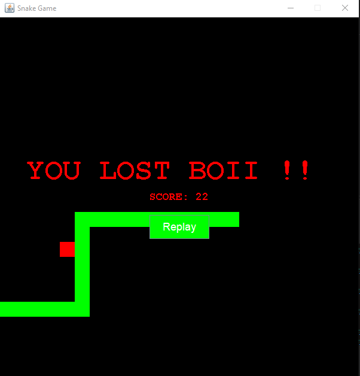
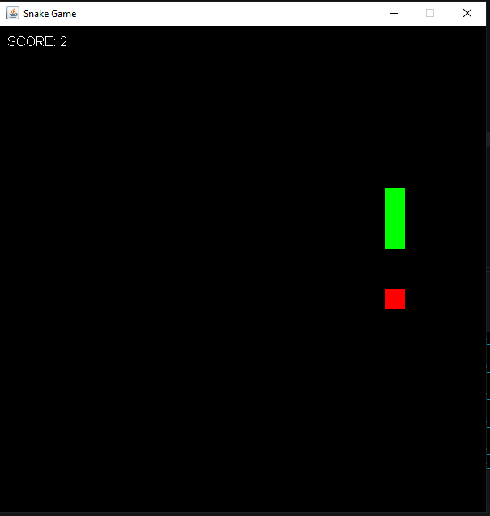

#  Java Snake Game

A simple **Snake Game built with Java and Swing**.
This project was created as a beginner Java project to practice **GUI development, event handling, object-oriented programming, and game logic**.

##  Features

* Classic Snake gameplay
* Arrow-key controls
* Food generation at random positions
* Score tracking
* Snake grows when eating food
* Collision detection with:

  * Game borders
  * The snake's own body

* Game Over screen
* Replay button to start a new game
* Retro-style visual design

##  Technologies Used

* **Java**
* **Java Swing** — Graphical User Interface
* **AWT** — Events, graphics, and keyboard input
* **ArrayList** — Managing the snake's body
* **Timer** — Updating the game continuously
* **Random** — Generating food positions

##  How to Play

Use the **arrow keys** to control the snake:

* ⬆️ **Up** — Move up
* ⬇️ **Down** — Move down
* ⬅️ **Left** — Move left
* ➡️ **Right** — Move right

Eat the food to increase your score and make the snake longer.

Avoid hitting the walls or the snake's own body!

##  Preview

##  Possible Improvements

Some ideas for future versions:

* Add different difficulty levels
* Add a high-score system
* Add sound effects
* Add a start menu
* Add pause functionality
* Add more food types or obstacles
* Improve the retro visual design

## 👩‍💻 Author

**Wafaa Aselgui**

Junior Web Full-Stack Developer
Morocco

---

This is one of my first Java projects, built to practice the fundamentals of Java through a small interactive game.

